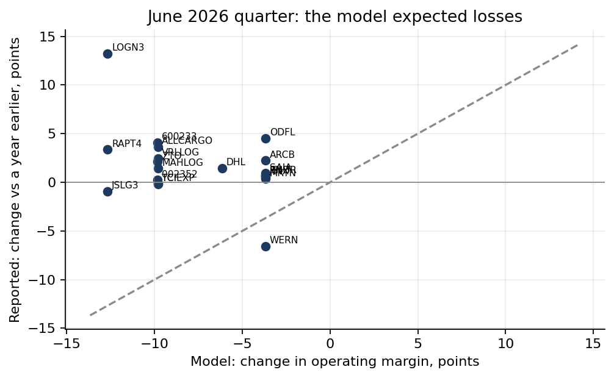

# Fuel Shock Stress Test

**A stress test of trucking and logistics margins under oil price shocks, across the US, India, China, Germany and Brazil, and what happened when a real shock arrived.**

## v1.0 (October 2026): the model met a real shock, and lost

Version 0.3 (July 2026) concluded that 16 of 22 listed trucking and logistics companies (73%) had more than a 5% chance of a negative operating margin within 12 months, and that margin discipline protects better than scale. Between March and June 2026, Brent went from about $70 to a monthly average of $117 (peak $138). The companies have since reported. [`notebooks/02_rebuild_and_2026_backtest.ipynb`](notebooks/02_rebuild_and_2026_backtest.ipynb) checks the model against them.

- **None of the 20 companies with comparable results reported a negative operating margin** in the March or June 2026 quarters, and **16 of 20 reported a higher margin than a year earlier** (median +1.2 points). Fed the actual Brent path, the model's mechanics predicted an average hit of 7.6 points and negative margins for 10 of them.
- **The "margin beats scale" finding was built in.** The model's only company-specific input is the trailing margin; size never enters. Breach probability is a perfect monotone function of one number, margin divided by fuel sensitivity (rank correlation -1). The top-risk names were companies already near zero margin.
- **Pass-through, re-estimated with an error-correction model** on weekly EIA data, 1994-2025. Within five weeks, diesel absorbs about 0.33 of a crude move, close to v0.3's 0.36. But the long-run elasticity is 0.70, and rises and falls pass through alike (no "rockets and feathers", p = 0.84). In the 2026 shock, diesel rose 0.73 times as much as Brent and peaked 32% above what crude alone predicted: the refining margin carried the shock.
- **Mean reversion in oil is unstable.** Five-year windows give half-lives from 3 months to nearly 5 years, and 2 of 23 show none at all. The headline hardly depends on it (15 to 18 companies), another sign that it reflects starting margins, not oil.
- **India's prices were administered.** Retail diesel was frozen from April 2022 to 15 May 2026, with state retailers absorbing about ₹100 a litre in April 2026 ([The Tribune, 23 April 2026](https://www.tribuneindia.com/news/business/no-plan-yet-to-raise-petrol-diesel-prices-oil-ministry/)). It was then raised 8.6% in ten days ([Bloomberg, 15 May 2026](https://www.bloomberg.com/news/articles/2026-05-15/indian-state-retailers-hike-petrol-diesel-prices-by-inr3-liter)). A fixed pass-through beta describes neither regime.



**What a better model needs:** the revenue side (fuel-surcharge clauses and freight rates, which dominated in 2026), diesel's refining margin as its own risk factor, and policy regimes for administered fuel prices. Until then, this repository is most useful as a case study in testing a model against the event it was built for.

## How the model works (v0.3, unchanged)

1. **Unit economics** (Excel, `excel/build_model.py`): a per-km cost model for a representative trucking operator in each country.
2. **Shock engine** (`src/monte_carlo.py`): a mean-reverting (Ornstein-Uhlenbeck) Monte Carlo of Brent, 10,000 paths over 12 months. Crude moves pass to diesel through a country beta, and to margins through fuel's share of revenue, with 50% surcharge recovery ramping in after two months.
3. **Company layer** (`src/company_survival.py`): the shock engine applied to each of 22 listed companies' trailing operating margins (Yahoo Finance).

The non-US betas and fuel shares are assumptions, not estimates; only the US beta was fitted to data.

## Repository

```
notebooks/01_analysis.ipynb                   v0.3 analysis (July 2026)
notebooks/02_rebuild_and_2026_backtest.ipynb  v1.0: audit, pass-through ECM, parameter checks, 2026 backtest
src/                                          data pipeline, Monte Carlo, company layer, quarterly margins fetch
excel/                                        unit economics model
data/public/                                  EIA prices (public domain), company screen and quarterly margins (Yahoo Finance)
charts/                                       figures
results_v1.json                               every number in the v1.0 notebook
```

## Reproduce

```bash
python -m venv .venv && .venv/bin/pip install -r requirements.txt
.venv/bin/python src/fetch_public_data.py          # EIA prices
.venv/bin/python src/fetch_quarterly_margins.py    # company results
cd notebooks && ../.venv/bin/jupyter nbconvert --to notebook --execute --inplace 02_rebuild_and_2026_backtest.ipynb
```

## Data

EIA crude and diesel prices (public domain). Company financials from Yahoo Finance (free, no key) for research use; figures are as reported by the companies.
